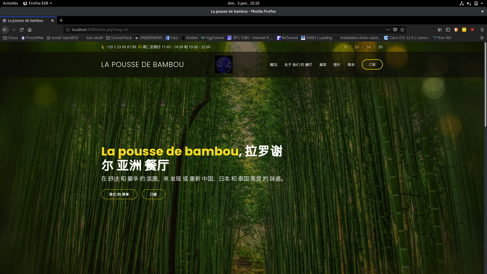
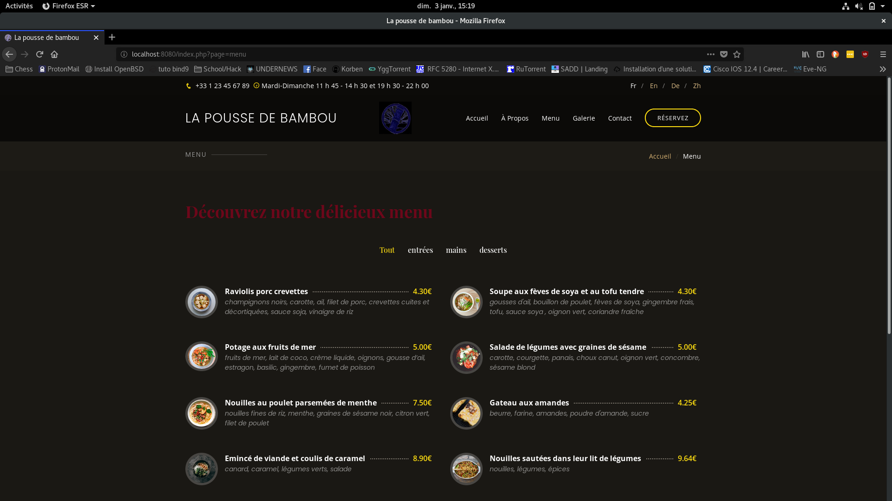
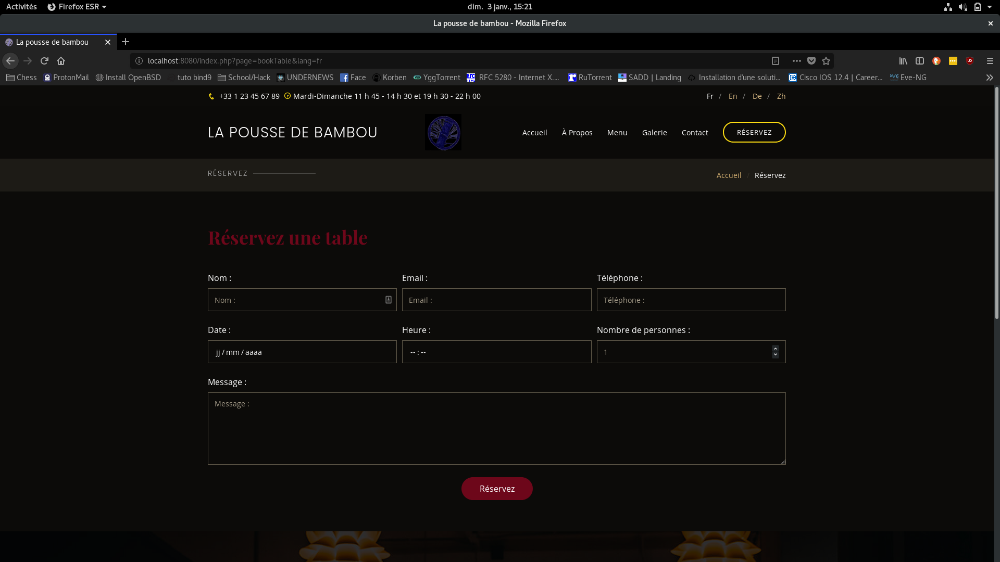
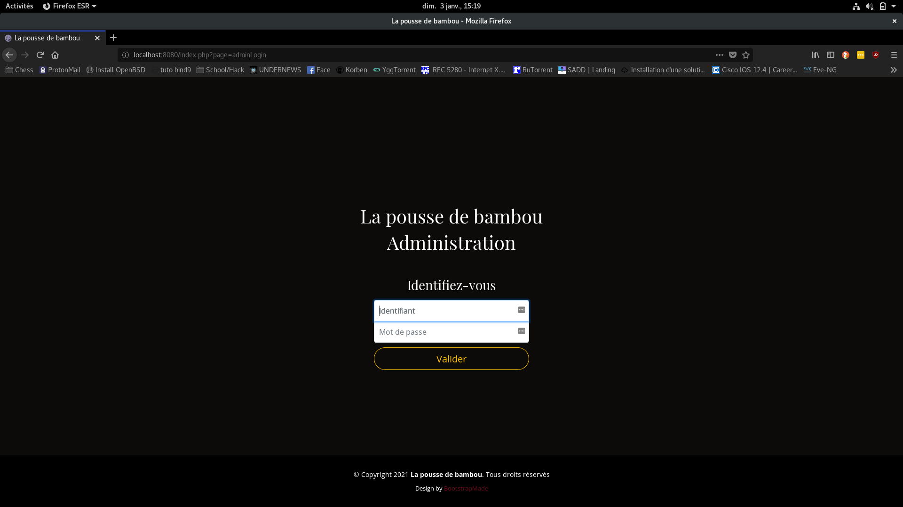
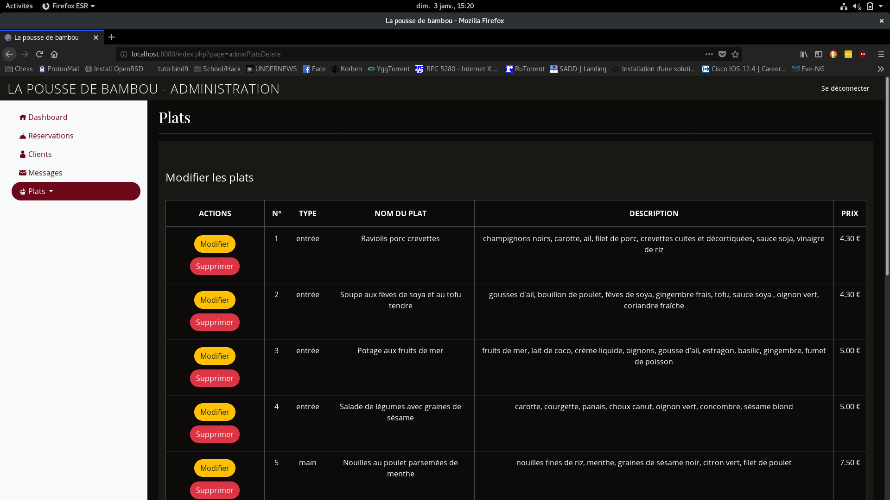

# La-pousse-de-bambou

site web d'un restaurant asiatique
dans le cadre du cours **Architecture et développement Web** à **La Rochelle Université.**
écrit en MVC Objet

## ScreenShots
 
 
 
 
 

## Fonctionnalités

- [x] base de données :
  - intégration de chaque plat du restaurant, ainsi que des types de plats
  - intégration des identifiants et mots de passe des administrateurs
  - enregistrement des clients (nom, mail, numéro de téléphone)
  - enregistrement des messages remplis dans les formulaires de contact
  - enregistrement des réservations

- [x] gestion administrative :
    - affichage des messages soumis dans les formulaires de contact
    - affichage des réservations
    - affichage des clients
    - possibilité d'ajout, modification et suppression des plats

## Bonus

- traduction en langues étrangères :
    - [x] anglais
    - [x] allemand
    - [x] chinois (mandarin simplifié)

## Author
**Lou Cherensac**